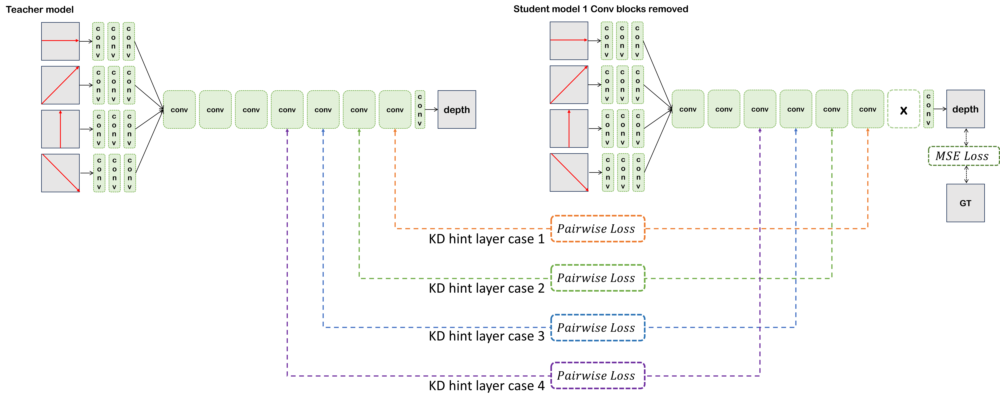

# Knowledge Distillation Framework for Simplified Fast Light Field Depth Estimation CNN Model

Ryutaro Miya, Kawaguchi Tatsuya, Takushi Saito

Contact: miya.r.aa@m.titech.ac.jp





## Environment

* PyTorch 2.0 (GPU)
* Python 3.11
* Other Packages

```
conda install --file requirements.txt
```

## Dataset

Download datasets from https://lightfield-analysis.uni-konstanz.de/
(4D Light Field Benchmark © 2024 )

## Configuration

Check the config.ini file in each model's directory.
Significant parameters for KD are as following.

[knowledgedistillation]
* lambda_mae = 0.6
* lambda_pairwise = 0.6

[training_general]
* batch_size_training = 16
* batch_num_in_1epoch_for_training = 100
* learning_rate = 0.0001

The best value of batch size we confirmed is 16, otherwise the convergence goes wrong.


## Train Model
1. Run .ipynb file (main.ipynb)